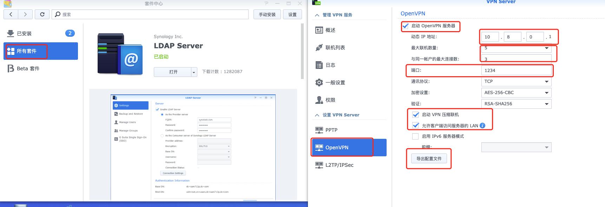
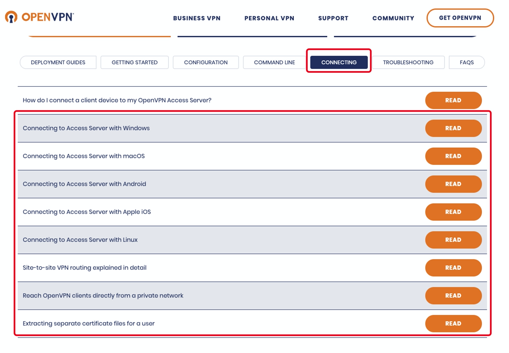

# OpenVPN

# 一、简介


# 二、在Synology上安装部署OpenVPN



# 三、使用OVA模版在ESXI上部署

- 官方文档：https://openvpn.net/vpn-server-resources/deploying-the-access-server-appliance-on-vmware-esxi/

- 最新ESXI OVA部署模板下载地址：https://openvpn.net/downloads/openvpn-as-latest-vmware.ova

- 支持在ESXI 5.0+ 上部署。直接使用vSphere Client客户端导入OVA文件创建虚拟机，步骤省略。

- 使用OVA部署OpenVPN Server的License只支持两个用户同时在线
- 默认使用sqlite存储数据，支持将数据转换存储到MySQL中
- 支持对接LDAP认证

## 虚拟机基本信息

- 1vCPU 1GB内存 512MB交换内存
- OS版本：Ubuntu 18.04.3 Server LTS x64
- 默认SSH用户密码：root / openvpnas
- 软件根路径：/usr/local/openvpn_as
- 日志目录：/usr/local/openvpn_as/init.log
- 重新配置命令：/usr/local/openvpn_as/bin/ovpn-init
- 已安装VM Tools，未安装curl

## 注意

1. 修改时区为CST。默认时区为US(Pacific - Los Angeles)

   ```bash
   timedatectl set-timezone "Asia/Shanghai"
   # 设置时区
   timedatectl status 
   # 查看当前的时区状态
   date -R
   # 查看时区
   ```

2. 设置openvpn用户密码（默认没有设置）

   ```bash
   passwd openvpn
   ```

3. (可选)设置静态IP地址（默认DHCP）

   ```bash
   nano /etc/netplan/01-netcfg.yaml
   # 配置模板
   network:
     version: 2
     renderer: networkd
     ethernets:
       eth0:
        dhcp4: no
        # ip设置为192.168.79.2
        addresses: [192.168.70.2/24] 
        gateway4: 192.168.70.254
        nameservers:
          addresses: [192.168.70.254]
          
   netplan apply
   ```

## Web UI访问地址

- 普通用户访问地址：https://openvpnas-ip:943 
- 管理员访问地址 ：https://openvpnas-ip:943/admin （默认用户openvpn，密码初始没有，需设置）

# 四、OpenVPN配置


# 五、客户端连接配置

不管是在Synology还是ESXI上安装的OpenVPN Server，都提供下载配置文件的连接。下载好配置文件后，可直接使用各个平台下的客户端直接导入打开


官方提供了各种平台下的客户端程序并提供了对应的文档说明

各客户端官方文档：https://openvpn.net/vpn-server-resources/connecting/



## MacOS客户端tunnelblick

MacOS上有好多客户端可以连接OpenVPN，功能大同小异。同时官方也有自己的macOS客户端`OpenVPN Connect Client`。但是推荐tunnelblick（官方也推荐），可同时连接多个OpenVPN Server

官方客户端文档：https://openvpn.net/vpn-server-resources/connecting-to-access-server-with-macos/

OpenVPN Connect Client for MacOS下载地址：https://openvpn.net/downloads/openvpn-connect-v3-macos.dmg

Tunnelblick下载地址：https://github.com/Tunnelblick/Tunnelblick/releases

## Windows客户端OpenVPN GUI

OpenVPN官网提供Windows平台客户端OpenVPN GUI。

只需将配置文件放在`C:\Users\当前用户\OpenVPN\config`文件下即可。(`~\OpenVPN\config`需手动创建)

官方客户端一次只能连一个服务端，如果有连接多个服务端的话，需要来回切换。

官方文档：https://openvpn.net/vpn-server-resources/connecting-to-access-server-with-windows/

下载地址：https://openvpn.net/community-downloads/

## Android

安卓手机平台官方虽说也提供客户端，但是只能在Google Play Store商店中下载，同时还一次只能连一个服务端。所以我们只好使用第三方客户端[ics-openvpn](https://github.com/schwabe/ics-openvpn)

GitHub地址：https://github.com/schwabe/ics-openvpn

APK下载地址：http://plai.de/android/ 

## IOS

对于Apple IOS手机客户端，官方APP名为`OpenVPN Connect`。而且一次只能连一个服务端。同时国内App Store还下不到。你说气不气。其他第三方客户端大多收费。幸好手机不是Iphone。这个就不管了！


